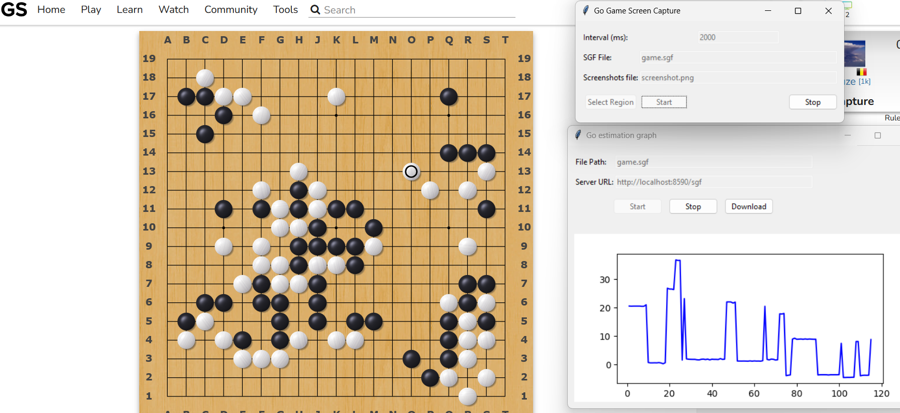

# Go position estimator

Shows the evaluation of the current go position. Tuned for OGS.

## Example



## Requirements

- python 3.XX
- python libraries in `requirements.txt`
- Katago binary and model for the correct architecture

## Components

### server.py

HTTP server for connection with `Katago`

```sh
uvicorn server:app --host 0.0.0.0 --port 8590
```

### gui_screenshotter.py

Periodically takes screenshots of the current go board, extracts SGF and saves it to a file.

```sh
python gui_screenshotter.py
```

### gui_graph.py

Peridically reads the SGF file, sends it to the server and shows the response in a graph.

```sh
python gui_graph.py
```

## Possible improvements

- Take the game in real time from `OGS` via API - the disadvantage is having to bombard the API with requests, there is no public websocket
